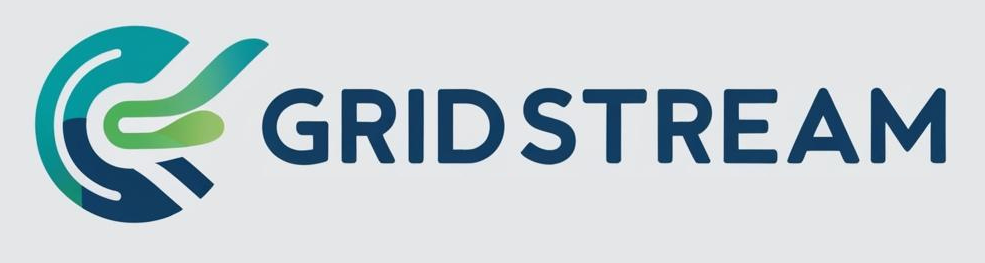

## Project FrontEnd

## Overview

**GridStream** is a project aimed at developing a scalable, reliable, and low-latency data pipeline that connects distributed energy resources (DERs) to the cloud for real-time verification purposes. By facilitating the exchange of energy data between DERs and contract specifications, GridStream supports efficient energy management and helps integrate renewable energy sources to the grid.

## Features

- Real-time data visualization
- Interactive user interface

## Technologies Used

- **React**: JS library for building user interfaces
- **Yarn**: Package manager for managing project dependencies

## Installation
tbd