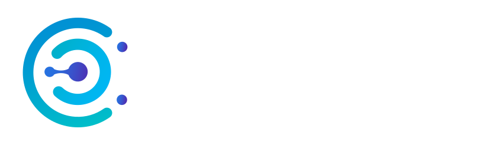

# <p align="center">Frontend</p>

<p align="center"></p>
<p align="center">This is the client side application of GridStream. It is a React.js application using Tailwind CSS.</p>

## 🧭 Table of Contents

- [Frontend](#-frontend)
  - [Table of Contents](#-table-of-contents)
  - [Team](#-team)
  - [Directory Structure](#-directory-structure)
  - [Contributing](#-contributing)
  - [Local Run](#-local-run)
    - [Prerequisites](#prerequisites)
      - [Windows](#windows)
      - [macOS](#macos)
    - [Steps](#steps)

## 👥 Team

| Team Member     | Role Title                | Description                                                                                                                                             |
| --------------- | ------------------------- | ------------------------------------------------------------------------------------------------------------------------------------------------------- |
| Matthew Collett | Technical Lead/Developer  | Focus on architecture design and solving complex problems, with a focus on the micro-batching process.                                                  |
| Cooper Dickson  | Project Manager/Developer | Ensure that the scope and timeline are feasible and overview project status, focus on UI and real-time transmission.                                    |
| Eric Cuenat     | Scrum Master/Developer    | In charge of agile methods for the team such as organizing meetings, removing blockers, and team communication, focus on UI and web socket interaction. |
| Sam Keays       | Product Owner/Developer   | Manager of product backlog and updating board to reflect scope changes and requirements, focus on database operations and schema design.                |

## 🏗️ Directory Structure

- `.husky/`
  - Husky config for pre-commit hooks
- `public/`
  - Holds static assets like images, and favicons. These files are made available to the public, for example, a company logo used in a static header is a good example of what to store here.
- `src/`

  - Everything under here is not released to the public. (This is where we store the bulk of our code)
  - `assets/`
    - Holds assets that will be used by components. For example, images that are used inside of components should typically be stored in the src/ folder (e.g., in src/assets/).
  - `components/`
    - Responsible for holding reusable components (e.g., buttons, forms, cards). **Custom Components should always start with a capitalized letter. This prevents React from getting confused with built-in components. Example: CustomButton.js not customButton.js**
  - `views/`
    - Page level components that represents routes in the app. A view will have multiple components to form a page. Example, SignIn view might have a form component with a button component.
  - `hooks/`
    - Custom React hooks that can be reused across components. See https://www.w3schools.com/react/react_customhooks.asp for a very simple example
  - `services/`
    - Handles interactions with external APIs, like our Express backend or third-party APIs (e.g., authentication services). For example, we will most probably have an apiClient.js file that handles creating an instance of axios which sets up config to avoid repetition every time we call our express backend.
  - `utils/`
    - Stores any useful helper methods that can be reused across the application
  - `config/`
    - Stores any configuration necessary for the front end
  - `state/`
    - Used to manage complex state to avoid "prop drilling". For example, storing the state of a user so we have access to know if they are logged in throughout the app.

- `.gitignore`
  - Files or directories that git ignores
- `.nvmrc`
  - Defines the Node.js version for a project
- `prettierrc.json`
  - Prettier config
- `CONTRIBUTING.md`
  - Document outlining contribution guidelines
    containers
- `package.json`
  - Specific to Node.js and JavaScript projects, used to manage dependencies, scripts, and project metadata
- `README.md`
  - This :-)
- `yarn.lock`
  - Created by Yarn to ensure consistent dependency versions across environments

## ⛑️ Contributing

For guidlines and instructions on contributing, please refer to [CONTRIBUTING.md](https://github.com/swe4103/swe4103-project/blob/main/CONTRIBUTING.md)

## 🚀 Local Run

### Prerequisites

- **Node.js** and **Yarn** must be installed on your machine. You can verify if you have these by running the following commands

```bash
node -v
yarn -v
nvm -v  # For Windows, use 'nvm version'
```

#### Windows

- You can download Node.js from the official [Node.js website](https://nodejs.org/en)
- After installing Node.js, install Node Version Manager (`nvm`) by following [this guide](https://www.freecodecamp.org/news/node-version-manager-nvm-install-guide/)
- After installing Node.js, install Yarn by running

```bash
npm install -g yarn
```

#### macOS

- On macOS, you can install Node.js via Homebrew

```bash
brew install node
```

- To install Node Version Manager (`nvm`), also use Homebrew

```bash
brew install nvm
```

**Note**: I had some issues with nvm not being added to my path, so if after installing you still cannot run `nvm -v`, add it to your path and try again

```bash
export NVM_DIR="$HOME/.nvm"
[ -s "/opt/homebrew/opt/nvm/nvm.sh" ] && \. "/opt/homebrew/opt/nvm/nvm.sh"
```

- To install Yarn, also use Homebrew

```bash
brew install yarn
```

- If you do not have Homebrew on your mac, I would highly recommend installing it [here](https://brew.sh/).

### Steps

1. First, start by cloning this repository to your local machine

```bash
git clone https://github.com/grid-stream-org/frontend.git
```

2. Navigate into the project directory

```bash
cd frontend
```

3. Install and use the version of node specified in the `.nvmrc` file by running the following commands

```bash
nvm install
nvm use
```

Note:
You may have to specify the actual version you wish to user here, as some operating systems don't pick upon the contents of the `.nvmrc` file. Try `nvm install <version> && nvm use <version>`

4. Install the necessary dependencies

```bash
yarn install
```

5. At this point, you can run the client

```bash
yarn run dev
```

Client application should be running at `http://localhost:5173`
